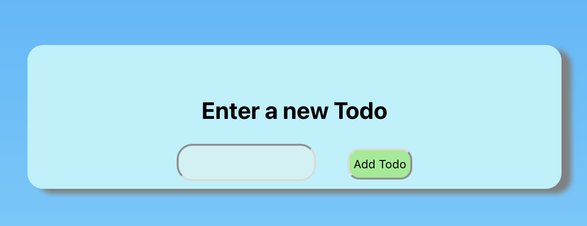
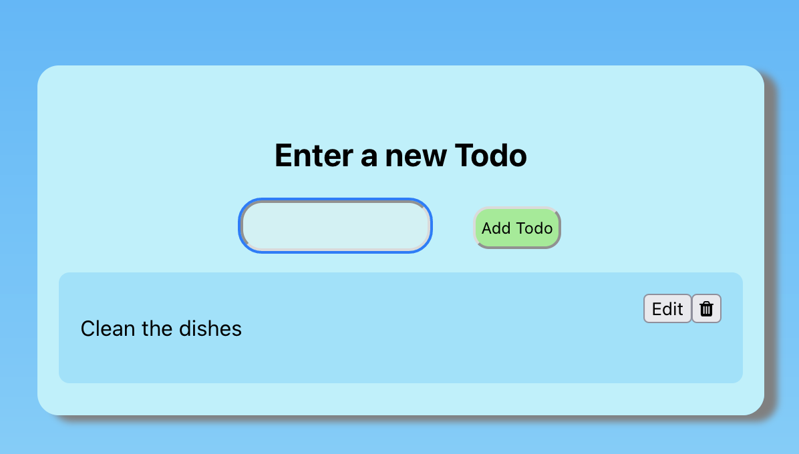
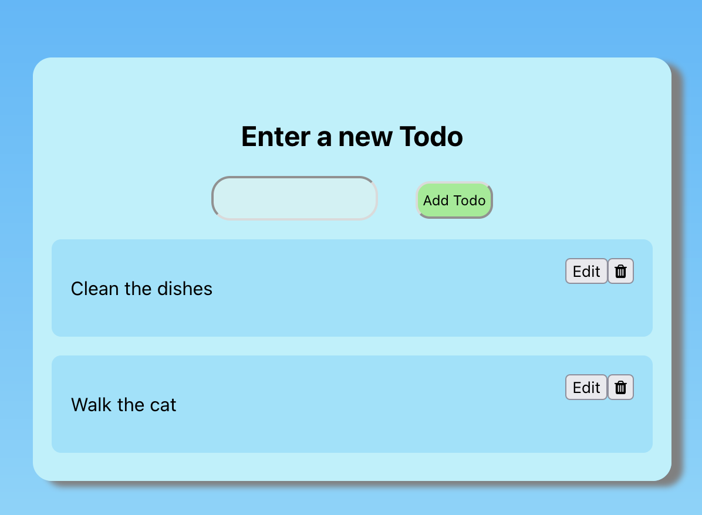
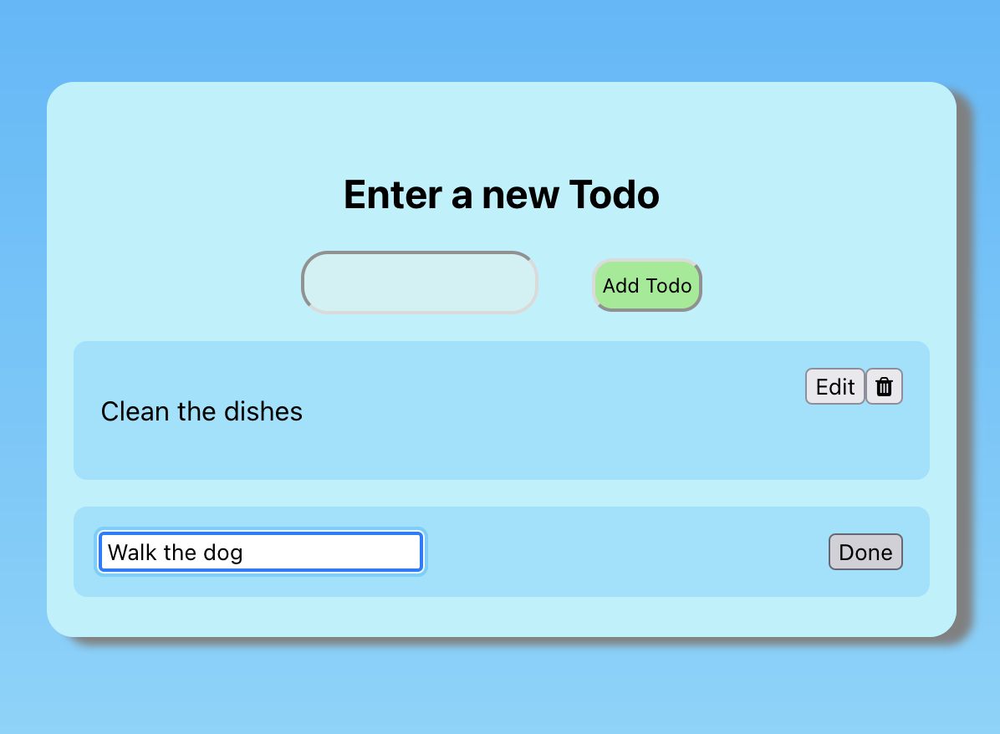
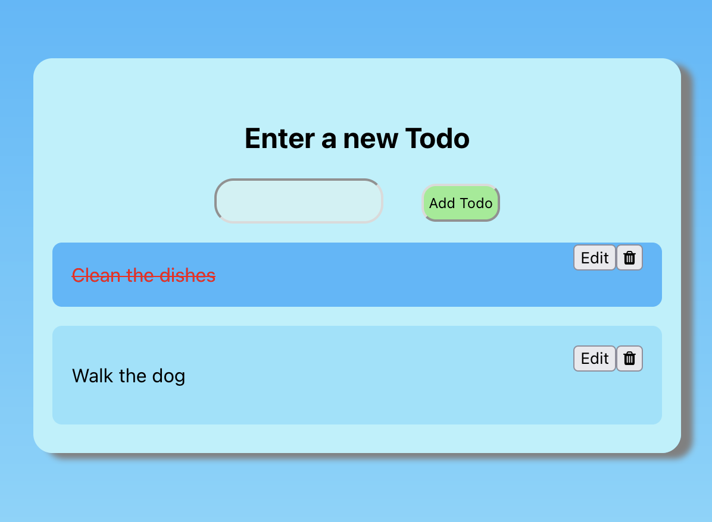

# Purpose
The purpose of this project was to practice and demonstrate knowledge of CRUD concepts. 

This was also my first big React project so it allowed me to use all the concepts I learned from the [React course I took on udemy.com with Colt Steele](https://www.udemy.com/course/modern-react-bootcamp/).

# Images
### Start screen, no todos

### First todo added

### Second todo added

### To edit an item click the edit button, then the todo label will change to a textbox you can enter in

### To complete a todo, simply click on it

# How to Install
After cloning the repository onto your machine, run the following two commands:
- `npm install`
- `npm install uuidv4`

# Components
`TodoList` - renders `NewTodoForm` and all `Todo` components
`NewTodoForm` - renders input form for user to enter new todo
`Todo` - renders Todo information with edit and delete button. Click to "complete" the todo.

# How it works

